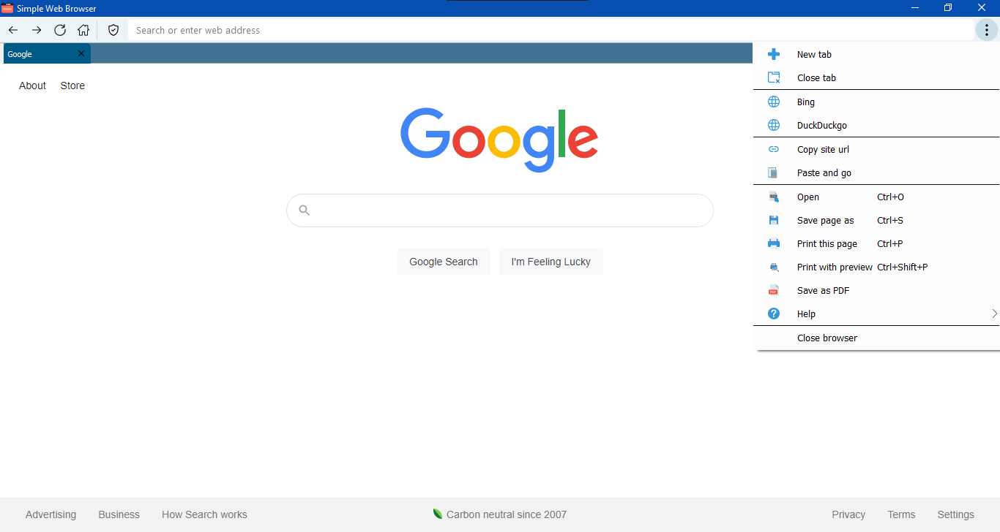

# PyQt5 Simple Web Browser

**Chromium based tabbed browser built with Python PyQt5 module**



Tested on:
Python version: Python 3.9.4-6 (64 bit)<br>
PyQt5 version: 5.15.4

<h3>Install dependencies</h3>
<i>On the cloned directory:</i>

```
python -m pip install -r requirements.txt
```

<h3>Run python file</h3>

```
python main.py
```

<br>
Some features :
  <ul>
    <li>Work with multiple tabs. Doubleclick on tab bar to open a new</li>
    <li>Search Google right from the address bar</li>
    <li>Open local files, save webpages</li>
    <li>Save as pdf</li>
    <li>Print webpages</li>
    <li>Copy site url to clipboard feature</li>
    <li>Paste and go feature</li>
    <li>Customize default search engine, startup page and new tab page</li>
  </ul>
<br>
