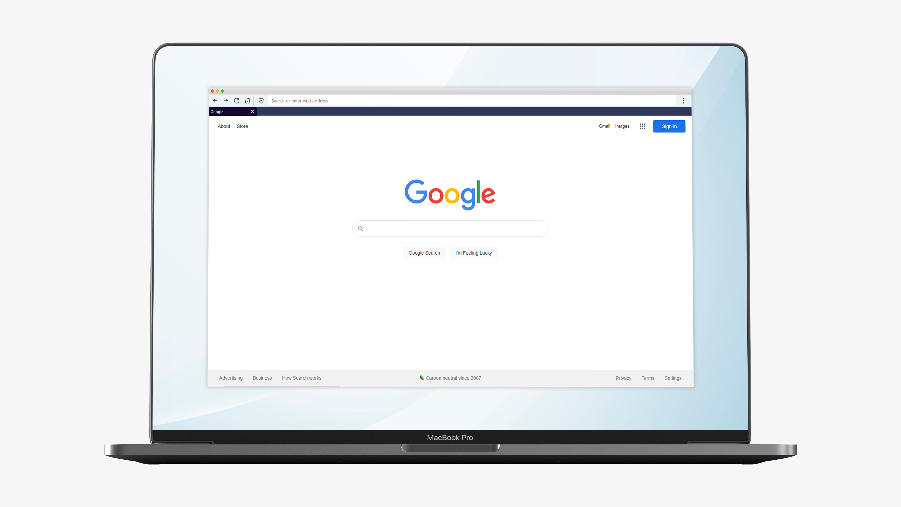

# PyQt5 Simple Web Browser



A tabbed browser created by me with Python, PyQt5 module with a bunch of features.

Tested on:  
Python version: Python 3.9 (64 bit)  
PyQt5 version: 5.15.4

### Install dependencies</h3>


```
python -m pip install -r requirements.txt
```

### Run python file

```
python main.py
```

### Some features:

- Work with multiple tabs. Double click on tab bar to open a new
- Search Google right from the address bar
- Open local files
- save webpages as html
- Save as pdf
- Print webpages
- Copy site url to clipboard feature
- Paste and go feature
- Customize default search engine, startup page and new tab page
